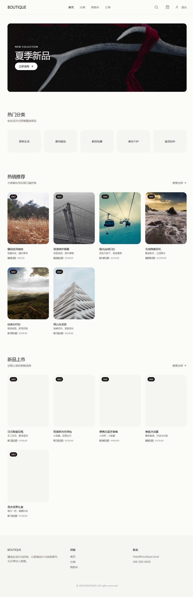
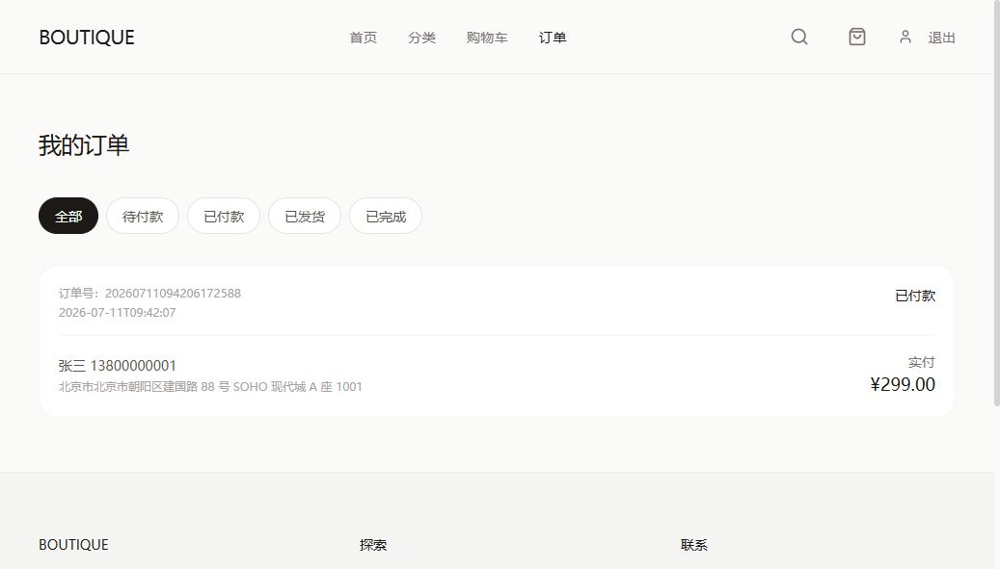

# BOUTIQUE 在线商城


一个以中性色、极简网格与高级感字体为设计基调的在线商城系统。后端采用 Java + Spring Boot 3 + MySQL + Redis 自实现，前端使用 React + Tailwind CSS + Framer Motion。

<p align="center">
  
</p>

## 技术栈

### 后端
- Java 17 + Maven
- Spring Boot 3.2
- MyBatis-Plus 3.5.6
- Sa-Token 1.38（认证鉴权）
- Redisson 3.27（分布式锁）
- Redis 7（缓存、会话）
- MySQL 8
- Knife4j（OpenAPI 文档）

### 前端
- React 19 + TypeScript
- Vite 6
- Tailwind CSS 4
- Zustand（状态管理）
- Framer Motion（微动效）
- React Router 7
- Axios

## 项目结构

```
online-shop/
├── backend/
│   ├── shop-common/       # 公共模块：实体、Mapper、Service、工具、配置
│   ├── shop-portal/       # 前台用户端接口（端口 8080）
│   ├── shop-admin/        # 管理后台接口（端口 8081）
│   └── pom.xml
├── frontend/              # React 前端（端口 5173）
│   └── public/screenshots/
├── sql/
│   ├── schema.sql         # 数据库结构
│   ├── data.sql           # 演示数据
│   └── init.sql           # 一键初始化（DROP + schema + data）
└── README.md
```

## 环境要求

- JDK 17+
- Node.js 18+
- MySQL 8.x，账号 `root` / `root`
- Redis 7.x（本地默认端口 6379）

## 快速启动

### 1. 初始化数据库

```bash
mysql -uroot -proot --default-character-set=utf8mb4 < sql/init.sql
```

### 2. 启动后端

```bash
cd backend
mvn clean install -DskipTests

# 需要两个终端分别启动
cd shop-portal && mvn spring-boot:run -DskipTests
cd shop-admin && mvn spring-boot:run -DskipTests
```

### 3. 启动前端

```bash
cd frontend
npm install
npm run dev
```

浏览器访问：http://localhost:5173

## 演示账号

| 角色 | 用户名 | 密码 |
|---|---|---|
| 普通用户 | user | 123456 |
| 管理员 | admin | 123456 |

## 接口文档

- 前台接口文档：http://localhost:8080/doc.html
- 管理后台接口文档：http://localhost:8081/doc.html

## 界面预览

| 首页 | 商品详情 | 订单中心 |
|---|---|---|
|  |  |  |

## 已实现功能

### 前台
- 首页：轮播图、商品分类、热销推荐、新品上市
- 商品列表与分类筛选
- 商品搜索
- 商品详情
- 购物车（增删改、选中、数量调整）
- 订单创建与模拟支付
- 订单列表与状态筛选
- 用户登录/注册

### 管理后台
- 管理员登录
- 商品管理（增删改查、上下架）
- 分类管理（增删改查）
- 订单管理（列表、发货）
- 用户管理（列表、状态调整）

## 高可用与并发设计

- **Redis 缓存**：可用于商品分类、热门商品、购物车等缓存（已预留结构，可扩展）。
- **Redisson 分布式锁**：用户维度购物车锁，防止同一用户并发下单重复扣库存。
- **数据库乐观锁（CAS）**：库存扣减使用 SQL 条件更新，保证原子性，避免超卖。
- **雪花算法订单号**：订单号使用 `IdWorker.getId()` 生成，高并发下不重复。
- **连接池优化**：HikariCP 配置合理的连接池参数。
- **接口统一返回**：统一响应格式与全局异常处理。
- **幂等设计**：订单号全局唯一，避免重复提交。

## 商品图片视觉规范

- 统一采用 4:5 竖版比例容器
- 图片使用 `object-cover` 填充，保持视觉一致性
- 圆角 `rounded-xl` / `rounded-2xl`，柔和过渡
- 中性灰背景占位，避免加载时突兀
- 卡片无粗边框，使用阴影与留白体现层级
