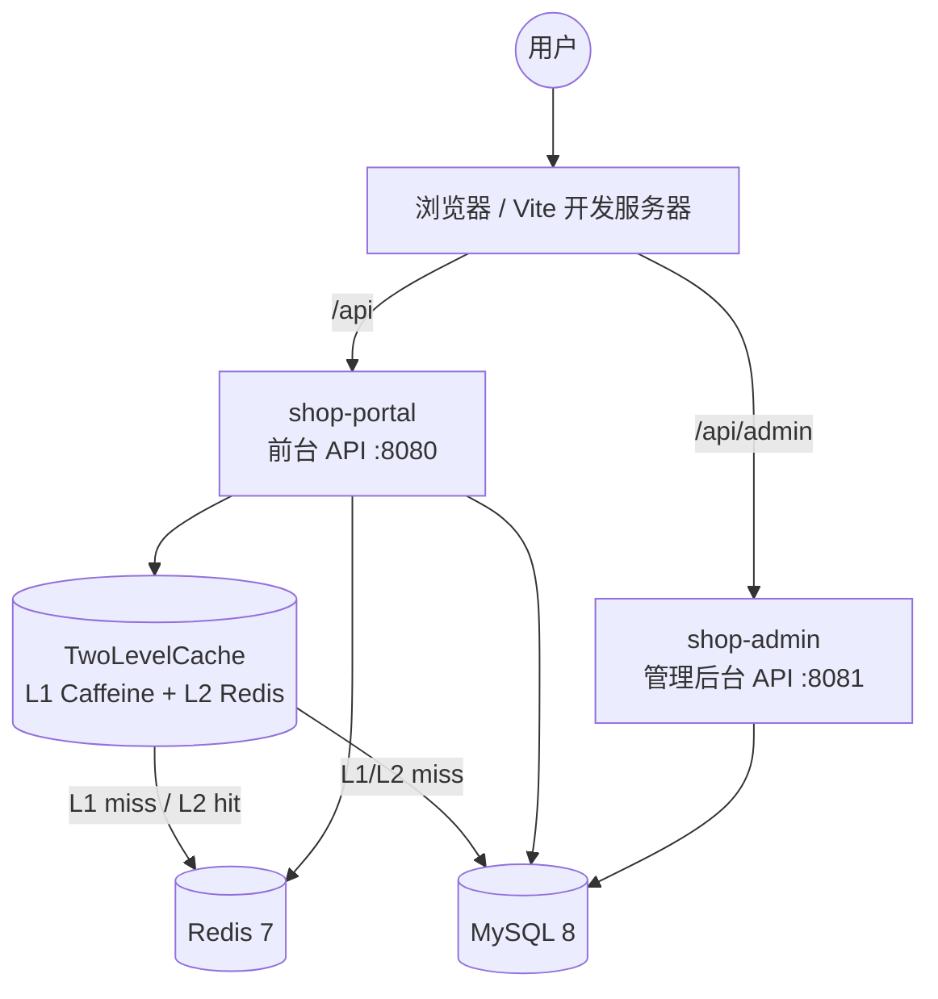
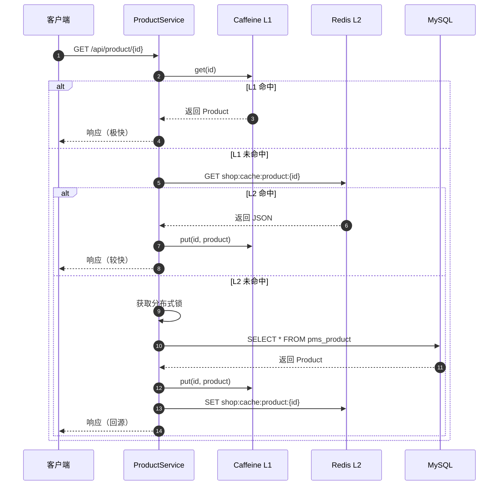
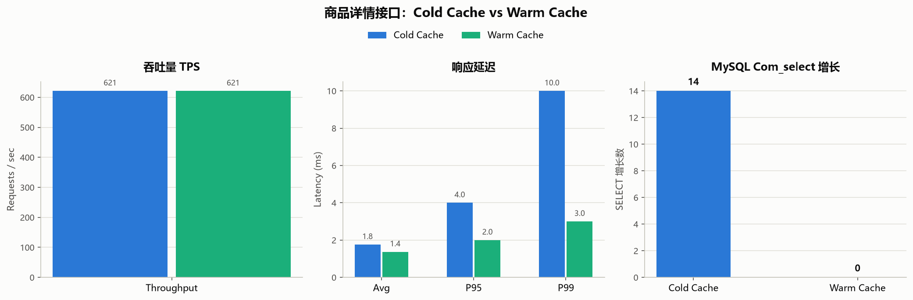
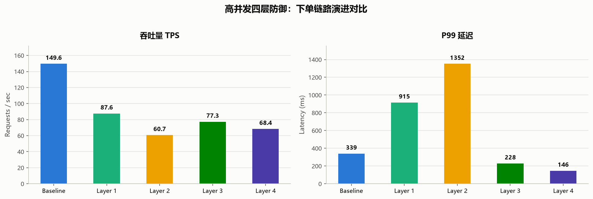
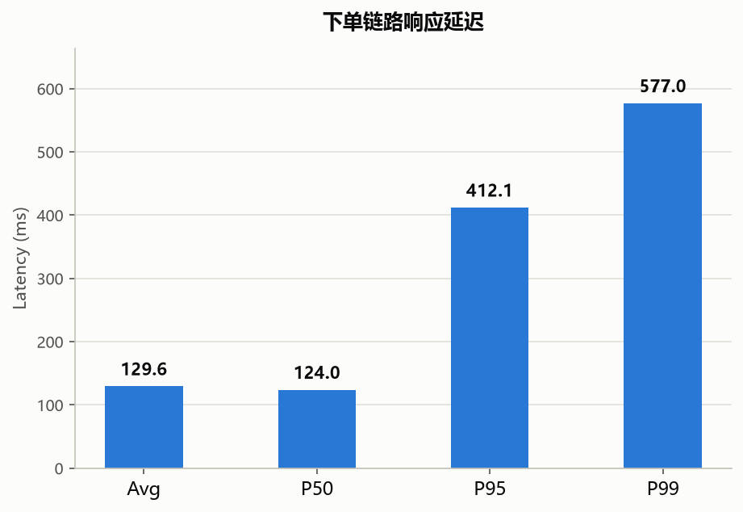

# BOUTIQUE 在线商城


一个以中性色、极简网格与高级感字体为设计基调的在线商城系统。后端采用 Java + Spring Boot 3 + MySQL + Redis 自实现，前端使用 React + Tailwind CSS + Framer Motion。

## 性能亮点

本地 Apache JMeter 压测（100 线程 × 30 轮，商品详情接口共 3000 请求）：

- **MySQL 读查询降为 0**：Warm Cache 下 `Com_select` 零增长，L1 Caffeine + L2 Redis 完全拦截数据库读。
- **P99 延迟从 10 ms → 3 ms**，降幅 **70%**；P95 从 4 ms → 2 ms，降幅 **50%**。
- **商品详情 TPS ~620**，缓存命中后数据库读压力从 O(n) 降到接近 O(1)。

👉 [查看完整压测结果与图表](#压测结果)

<p align="center">
  
</p>

## 目录

- [性能亮点](#性能亮点)
- [技术栈](#技术栈)
- [项目结构](#项目结构)
- [快速启动](#快速启动)
- [演示账号](#演示账号)
- [接口文档](#接口文档)
- [已实现功能](#已实现功能)
- [界面预览](#界面预览)
- [系统架构](#系统架构)
- [高并发四层防御架构](#高并发四层防御架构)
- [压测结果](#压测结果)
- [本地 JMeter 压测](#本地-jmeter-压测)
- [GitHub Actions 自动压测](#github-actions-自动压测)

## 技术栈

### 后端
- Java 17 + Maven
- Spring Boot 3.2
- MyBatis-Plus 3.5.6
- Sa-Token 1.38（认证鉴权）
- Redisson 3.27（分布式锁）
- Redis 7（缓存、会话）
- MySQL 8
- Knife4j（OpenAPI 文档）

### 前端
- React 19 + TypeScript
- Vite 6
- Tailwind CSS 4
- Zustand（状态管理）
- Framer Motion（微动效）
- React Router 7
- Axios

## 项目结构

```
online-shop/
├── backend/
│   ├── shop-common/       # 公共模块：实体、Mapper、Service、工具、配置
│   ├── shop-portal/       # 前台用户端接口（端口 8080）
│   ├── shop-admin/        # 管理后台接口（端口 8081）
│   └── pom.xml
├── frontend/              # React 前端（端口 5173）
│   └── public/screenshots/
├── sql/
│   ├── schema.sql         # 数据库结构
│   ├── data.sql           # 演示数据
│   ├── init.sql           # 一键初始化（DROP + schema + data）
│   └── optimize_indexes.sql # 生产环境索引/版本号/归档表优化脚本（幂等）
├── scripts/benchmark/     # 压测脚本与结果
│   ├── prepare_bench_data.py
│   ├── benchmark_order_create.py
│   ├── benchmark_product_detail.py
│   ├── run_jmeter_benchmark.py   # JMeter 一键压测入口
│   ├── generate_charts.py        # 结果图表生成
│   ├── jmeter/                   # JMeter 测试计划与生成器
│   │   ├── generate_jmx.py
│   │   ├── product_detail_cache.jmx
│   │   └── order_create.jmx
│   └── results/
├── docs/images/           # README 架构图与压测图表
└── README.md
```

## 快速启动

环境要求：JDK 17+、Node.js 18+、MySQL 8（`root`/`root`）、Redis 7、Maven。

### 1. 初始化数据库

```bash
mysql -uroot -proot --default-character-set=utf8mb4 < sql/init.sql
# 可选：追加索引/版本号/归档表（幂等）
mysql -uroot -proot --default-character-set=utf8mb4 < sql/optimize_indexes.sql
```

### 2. 启动后端

```bash
cd backend
mvn clean install -DskipTests

cd shop-portal && mvn spring-boot:run -DskipTests
cd shop-admin && mvn spring-boot:run -DskipTests
```

### 3. 启动前端

```bash
cd frontend
npm install
npm run dev
```

访问：http://localhost:5173

## 演示账号

| 角色 | 用户名 | 密码 |
|---|---|---|
| 普通用户 | user | 123456 |
| 管理员 | admin | 123456 |

## 接口文档

- 前台接口文档：http://localhost:8080/doc.html
- 管理后台接口文档：http://localhost:8081/doc.html

## 已实现功能

- **前台**：首页、商品列表/搜索/详情、购物车、订单创建与模拟支付、订单列表、用户登录/注册。
- **管理后台**：商品/分类/订单/用户管理。

## 界面预览

| 首页 | 商品详情 | 订单中心 |
|---|---|---|
|  |  |  |

## 系统架构

### 整体架构



### L1 / L2 缓存读取流程



## 高并发四层防御架构

针对 `POST /api/order/create` 下单链路，按“流量逐层递减”的思路做了四层递进式优化：

```mermaid
flowchart LR
    subgraph L1["Layer 1：应用层"]
        A1[接口限流]
        A2[L1 Caffeine<br/>L2 Redis 缓存]
        A3[Resilience4j<br/>熔断/降级]
        A4[Sa-Token<br/>无状态登录]
    end

    subgraph L2["Layer 2：缓存层"]
        B1[布隆过滤器防穿透]
        B2[热点 key<br/>分布式锁重建]
        B3[Redis Lua<br/>原子库存预扣]
        B4[TTL 抖动<br/>防雪崩]
    end

    subgraph L3["Layer 3：异步队列层"]
        C1[下单预扣库存]
        C2[Redis List 入队]
        C3[后台 Worker 消费落库]
        C4[UserID+商品维度幂等锁]
    end

    subgraph L4["Layer 4：存储层"]
        D1[HikariCP 连接池]
        D2[批量插入订单明细]
        D3[MyBatis-Plus @Version 乐观锁]
        D4[关键索引与归档表]
    end

    L1 --> L2 --> L3 --> L4
```



### 关键代码位置

| 层级 | 能力 | 主要文件 |
|------|------|----------|
| Layer 1 | L1/L2 缓存 | `backend/shop-common/src/main/java/com/shop/common/cache/TwoLevelCache.java` |
| Layer 1 | 限流 | `backend/shop-common/src/main/java/com/shop/common/limit/RateLimiter.java`、 `scripts/rate_limit.lua` |
| Layer 1 | 熔断 | `backend/shop-common/src/main/java/com/shop/common/config/Resilience4jConfig.java` |
| Layer 2 | 布隆过滤器 + 缓存重建 | `backend/shop-common/src/main/java/com/shop/common/bloom/BloomFilterService.java`、 `ProductServiceImpl.java` |
| Layer 2 | Lua 原子库存 | `backend/shop-common/src/main/java/com/shop/common/stock/RedisStockService.java`、 `scripts/stock_deduct.lua` |
| Layer 3 | 异步队列 | `backend/shop-common/src/main/java/com/shop/common/mq/OrderCreateProducer.java`、 `OrderCreateConsumer.java` |
| Layer 3 | 超时兜底 | `backend/shop-common/src/main/java/com/shop/common/mq/OrderTimeoutRefundJob.java` |
| Layer 3 | 前端轮询 | `frontend/src/pages/CartPage.tsx` |
| Layer 4 | 批量插入 | `backend/shop-common/src/main/resources/mapper/OrderItemMapper.xml` |
| Layer 4 | 连接池调优 | `backend/shop-portal/src/main/resources/application.yml` |
| Layer 4 | 归档 | `backend/shop-common/src/main/java/com/shop/common/archive/OrderArchiveService.java` |

## 压测结果

> 环境：Windows 10 / JMeter 5.4.1 / JDK 17 / MySQL 8.0.34 / Redis 3.2.100。  
> 产物见 `scripts/benchmark/results/`（JSON / Markdown / JTL）与 `docs/images/` 图表。

### 缓存效果验证

读多写少的商品详情接口 `GET /api/product/{id}` 最能体现缓存价值：

<p align="center">
  
</p>

| 指标 | Cold Cache | Warm Cache | 提升 |
|------|------------|------------|------|
| 总请求 | 3000 | 3000 | - |
| TPS | 621.38 | 621.25 | - |
| 平均延迟(ms) | 1.76 | 1.37 | +22% |
| P95(ms) | 4.00 | 2.00 | +50% |
| P99(ms) | 10.00 | 3.00 | +70% |
| **MySQL Com_select 增长** | **14** | **0** | **DB 读降为 0** |

Warm Cache 下 `Com_select` 零增长，说明 L1 Caffeine + L2 Redis 完全拦截了商品详情的数据库读，尾延迟显著下降。

### 下单链路演进

<p align="center">
  
</p>

环境：250 独立用户各下单 1 次（商品 13 初始库存 300）。Layer 3/4 为异步流程，脚本轮询 `/api/order/create/status` 至 SUCCESS/FAILED。

| 指标 | Baseline | Layer 1 | Layer 2 | Layer 3 | Layer 4 |
|------|----------|---------|---------|---------|---------|
| 成功下单 | 249 | 189 | 189 | 187 | 189 |
| 业务失败 | 1 | 61 | 61 | 63 | 61 |
| TPS | 149.58 | 87.62 | 60.71 | 77.34 | 68.39 |
| 平均延迟(ms) | 289.72 | 377.95 | 543.31 | 57.23 | 42.21 |
| P95(ms) | 331.28 | 634.62 | 899.64 | 194.08 | 105.37 |
| P99(ms) | 339.80 | 915.75 | 1352.06 | 228.96 | 146.93 |
| 超卖数 | 0 | 0 | 0 | 0 | 0 |

- **Baseline**：同步落库，直接压 MySQL，P99 约 340ms。
- **Layer 1/2**：限流 + 缓存 + Redis 预扣，同步链路变长但 MySQL 压力下降。
- **Layer 3/4**：异步队列削峰填谷，接口立即返回 `PENDING`，延迟大幅下降；全层级 **0 超卖**。

### 下单链路延迟

<p align="center">
  
</p>

| 指标 | 数值 |
|------|------|
| 总请求 | 500 |
| 成功 | 450 |
| 失败 | 50 |
| 错误率 | 10.0% |
| TPS | 93.05 |
| 平均延迟(ms) | 129.59 |
| P95(ms) | 412.05 |
| P99(ms) | 577.01 |

## 本地 JMeter 压测

前置条件（Windows 示例）：

```bash
export JMETER_HOME=/c/develop/apache-jmeter-5.4.1
export PATH=$PATH:/c/develop/apache-jmeter-5.4.1/bin:/c/develop/Redis-x64-3.2.100

jmeter --version
redis-cli ping
```

1. 安装依赖：
```bash
cd scripts/benchmark
pip install -r requirements.txt
```

2. 重置数据库并准备压测数据：
```bash
mysql -uroot -proot --default-character-set=utf8mb4 < sql/init.sql
mysql -uroot -proot --default-character-set=utf8mb4 < sql/optimize_indexes.sql

cd scripts/benchmark
python prepare_bench_data.py --users 250
```

3. 构建并启动后端：
```bash
cd backend
mvn clean install -DskipTests
cd shop-portal && mvn spring-boot:run -DskipTests
```

4. 一键压测：
```bash
cd scripts/benchmark
python run_jmeter_benchmark.py \
  --wait-for-backend \
  --users 250 \
  --product-threads 100 --product-loops 30 \
  --order-threads 250 --order-loops 1 \
  --ramp-up 5 \
  --restart-cmd "python restart_backend.py"
```

5. 生成图表：
```bash
cd scripts/benchmark
python generate_charts.py
```

产物：
- `results/jmeter_summary.json` / `jmeter_report.md`
- `results/*.jtl`
- `results/*.report/index.html`（加 `--html-report` 时）
- `docs/images/*.png`

## GitHub Actions 自动压测

修改 `backend/`、`scripts/benchmark/` 或 `.github/workflows/benchmark.yml` 时自动触发；也可手动运行：

```bash
gh workflow run benchmark.yml
```

工作流会启动 MySQL + Redis，构建并运行 JMeter 压测，生成图表并上传产物，结果摘要写入 Actions 运行页。
